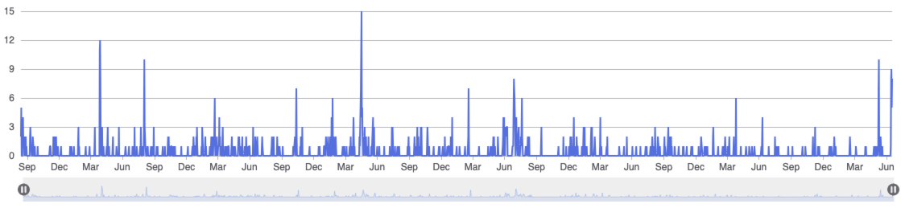

# GROUPRESS框架演示项目

  * author：gary diao [(gary.diao@yahoo.com)](gary.diao@yahoo.com)
  * version：0.4.0
  * repository: [GP Central Repository](https://central.sonatype.com/search?q=groupress)


*2017-2024*

## 简介

Web应用开发从最早的Servlet开发到现在微服务开发，应用项目的代码结构到技术构成已经发生了巨大的变化。
在目前应用开发中前-后分离已经成为十分普遍，实际工作中Spring-boot以其无可争议的普及程度，无疑成为
此中翘楚。随着基于spring-boot开发逐渐深入，由于长期关注与产品级系统开发，于是考虑能否构建一个轻量
化的框架，用来保证产品的持续性，而不必疲惫的跟着spring-boot去不断升级和重构，这也成为我开发
groupress这个所谓的“轮子”的初衷。

Spring框架经过多年的发展，它的优点无须赘述，至于缺点见仁见智，在此不做评述。在构思GP框架的过程中，发
现了[light-4j](https://github.com/networknt/light-4j)，于是决定基于light-4j构建groupress框架（简称：GP）。

*** 

## 框架目标及特点

* 框架以性能优先、稳定性优先为首要目标

    对于国内的开发人员来说，优雅的代码风格曾是许多人工作中追求的目标之一，甚至至今仍有许多人拿着大厂的开发标准作为开发工作规约。这些要求并非多余，但在面对最终的交付质量要求而言有些多余。
    开发工作首要保证的是性能和稳定，其他都是浮云。所以GP框架在此目标下选择light-4j作为基础进行构建。

* 轻量化优先，避免冗余依赖，排除非必要的依赖路径，工具型框架为主要方向

    以产品级系统的后端开发为应用场景，排除非必要的冗余特性构成。让构建后的应用最大程度实现轻量依赖，一方面精心选择功能足够
    丰富的外部包如：guava，light-4j，jackson等，以及必要的手搓开发如:接口参数验证功能。

* 迭代持续性优先
    
    为保证产品开发的持续性，避免因为框架升级而导致对既有产品的影响，在框架特性上严格把握，以‘奥卡姆剃刀’为设计原则
    确保版本的一致性。基于java11构建，充分利用lambda特性，确保对高版本的兼容

* 透明化代码构成

    任何框架随着升级必然会变的更加复杂，一方面增加了学习难度，另一方面复杂度的增加也意味着可靠性风险增加。面对复杂的程序和繁杂的封装，
    开发人员往往难以对应用有自下而上的全面了解和掌控，因此在设计框架中从纵向的分级构建和横向模块管理两方面尽量进行最简化设计，目的
    在于为开发人员提供一键JumpIn的开发体验，实现框架代码对开发者完全透明。

***

## [Groupress框架介绍](./gp.help/framework.md)

    对框架内部的设计构成及实现机制进行详细说明  

  * 框架基本结构（第三方依赖情况及使用说明）
    * 开发包整体结构及说明
    * 开发包依赖关系
    * 其他说明
  * Bean声明及自动绑定设计及实现机制
  * Bean数据复制的设计及实现机制
  * 数据事物的处理及实现机制
  * SQL代码的DSL开发风格设计及实现
  * DAO的设计及实现
    * BaseDAO介绍
    * ExtendDAO介绍
    * 服务代码生成工具介绍
  * Service数据服务的设计及实现
    * 基础服务的设计实现
    * LinkerService设计服务实现
    * ActionService设计服务实现
  * API服务的设计及实现机制 
  * 接口服务校验的设计及实现
  * 异步事件的处理机制及设计实现
  * 应用启动器介绍
    * AppLauncher介绍（Daemon下的远程命令模式）
    * Light4j的启动过程介绍
  
***

## [启动项目结构](./gp.help/project.md)

  * 应用依赖说明及模块命名规范
  * 应用环境说明
  * 应用启动过程说明
  * 如何生成DAO
  * 如何生成服务
  * 如何实现业务设计
  * 如何实现接口服务
  * 事件的捕捉和处理

***

## [启动项目部署及发布](./gp.help/deploy.md)

To make it easy for you to get started with GitLab, here's a list of recommended next steps.

Already a pro? Just edit this README.md and make it your own. Want to make it easy? [Use the template at the bottom](#editing-this-readme)!

## Add your files

- [ ] [Create](https://docs.gitlab.com/ee/user/project/repository/web_editor.html#create-a-file) or [upload](https://docs.gitlab.com/ee/user/project/repository/web_editor.html#upload-a-file) files
- [ ] [Add files using the command line](https://docs.gitlab.com/ee/gitlab-basics/add-file.html#add-a-file-using-the-command-line) or push an existing Git repository with the following command:

```
cd existing_repo
git remote add origin https://gitlab.com/g4497/gp-starter-svr.git
git branch -M main
git push -uf origin main
```
