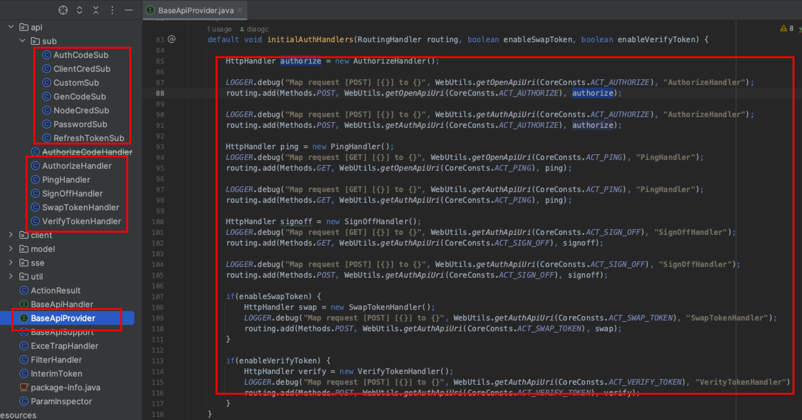

# API服务的设计及实现机制

GP框架是在light-4j基础上扩展的服务开发框架，因此最终需要通过API实现对外的服务处理。熟悉spring开发
那么一定知道DisptatchServlet的作用，它接收全部请求，依据路径和method对请求进行路由分发。GP框架采用
类似的设计实现API请求分发。

在light-4j中，提供了一类处理器即：MiddlewareHandler,它可以对全部的请求进行过滤处理，但是同DispatchServlet
不同，它更多承担过滤器的作用。在底层undertow中有RoutingHandler专门负责请求的路由分发工作。

在GP框架中，主要解决以下问题：
1. 框架中认证登录等相关代码的统一注册处理
2. 请求鉴权处理主要放在FilterHandler中，它是基于MiddlewareHandler开发的过滤器
3. 应用级业务API服务的检查和注册

## 框架中认证登录等相关代码的统一注册处理



登录相关处理有如下场景：

* 路径：/opapi/authorize

1. 账户+密码方式

    参数：
       
        {
            grant_type: passowrd,
            client_id: xxx,
            client_secret: yyy,
            username: xxxx,
            password: xxx,
            device: zzz
        }

    返回值：

        {
            access_token: xxxx,
            token_type: xxx,
            expire_in: zzz,
            refresh_token: mmm
        }

2. 授权码方式

   参数：

        {
            grant_type: authorization_code,
            client_id: xxx,
            client_secret: yyy,
            code: xxxx,
            redirect_uri: xxx,
            csrf: zzz
        }

   返回值：

        {
            access_token: xxxx,
            token_type: xxx,
            expire_in: zzz,
            refresh_token: mmm
        }

2. 客户端认证

   参数：

        {
            grant_type: client_credentials,
            client_id: xxx,
            client_secret: yyy,
            scope: xxxx
        }

   返回值：

        {
            access_token: xxxx,
            token_type: xxx,
            expire_in: zzz,
        }

* /opapi/ping 检查请求处理

* /opapi/sign-off 退出处理

其他相关的认证处理，稍后补充。目前框架也支持定制的认证处理逻辑

## 请求鉴权处理

GP框架提供默认两类请求控制：/opapi 和 /gpapi,两个路径分别对应开放API和业务API。
请求鉴权处理通过FilterHandler实现，该过滤器会检查请求header中的Authorization值是否通过校验来验证
是否为合法请求，将请求交由RouterHandler继续处理。

## GP框架中API服务的检查和处理

在Spring框架中，服务处理的注册过程是通过@Controller注解说明实现的。GP框架没有使用类似的注解方式进行API
服务的自动注册，而是采用手动包探测的方式确定应用提供的对外服务API信息。

### API服务的定义方式

参考undertow的开发方式，API的定义要求方法的入参是固定类型:HttpServerExchange,方法无返回参数，Response的回
写操作通过BaseApiSupport.sendResult实现。采用这种形式进行API主要是由于undertow中的处理过程是支持异步处理的，
如果使用返回值，那么显然返回结果无法确保异步过程中的中断退出情况。

框架返回值格式采用如下形式

      {
         meta: {
                  code: "xxx", // 额外标记编码
                  message: "xxx",
                  status: "xxx", // 处理状态：success, failure, error
               },
         data: {
                  vaaa: "xxxxx"
               }
      }

Api声明示例如下：

``` 
// BaseApiSupport是基于BaseApiHandler扩展的Api支持类
public class DemoHandler extends BaseApiSupport {

    // Api声明，method支持多值设置如：method="GET,POST"
    @WebApi(path="demo-operate", method="GET", open=true)
    public void handleDemoOperate(HttpServerExchange exchange)throws BaseException{
        
        ActionResult result = new ActionResult();
   
        Map<String, Object> params = this.getRequestBody(exchange);
        
        ArgsValidator.newValidator(params)
            .require("org_id", "dept_name")
            .validate(true);
        
        long parentId = Filters.filterLong(params, "dept_pid");
        if(parentId <= 0)
            parentId = GeneralConsts.HIER_ROOT;
            
        ServiceContext svcctx = this.getServiceContext(exchange, Operations.ORG_NEW);
        
        .....
        
        result = ActionResult.success(getMessage(exchange, "mesg.new.depthier"));
        
        this.sendResult(exchange, result);
    }
    
    ...
 }
```

### API服务的探测过程

GP框架通过对指定package路径下的类进行探测获得API声明信息，进而利用RouterHandler进行API服务注册的，具体处理
过程如下：

1. BaseApiProvider.detectHandlers(RoutingHandler routing, String pack)方法启动API服务探测过程
2. 利用ASM技术动态构建一个package级的服务代理访问对象，该对象的作用是可以快速获得Handler对象中的指定的API服务方法
   因为方式声明都采用相同形式：public void xxMethod(HttpServerExchange exchange)，可知这是一个类似Consumer
   的对象，在GP框架中ApiConsumer。

   ``` 
   // 代理的源代码实例，实际上通过ASM自动构建
   public class ApiHandler$Proxy implements ApiHandlerProxy {

     @Override
     public ApiConsumer getApiReference(BaseApiHandler stub, String methodName) {
         String clazzname = ApiHandlerProxy.getAbsoluteName(stub.getClass());
         switch (clazzname){
             case "DemoApiHandlerxxxx":
                 return getApiDemoApiHandlerxxxx((DemoApiHandler)stub, methodName);
             case "DemoApi2Handlerxxxx":
                 return getApiDemoApi2Handlerxxxx((DemoApi2Handler)stub, methodName);
             default:
                 return null;
         }
     }

     private ApiConsumer getApiDemoApiHandlerxxxx(DemoApiHandler stub, String methodName){
         switch (methodName){
             case "handleDemo0":
                 return stub::handleDemo0;
             case "handleDemo1":
                 return stub::handleDemo1;
             case "handleDemo2":
                 return stub::handleDemo2;
             default:
                 return null;
         }
     }

     ....
   }
   
   ```   

3. 生成完动态代理类后，遍历指定包下的全部类

   1. 忽略非BaseApiHandler的子类对象
   
   2. 利用类的默认构造函数创建实例handler
   
   3. 如果handler属于BaseApiSupport类的子类实例，那么执行BaseApiSupport.detectPathMapping(proxy)
      探测handler内部的API声明。
   
      1. 遍历handler内部全部的标记@WebApi的方法，并记录（ApiKey, ApiConsumer）对至内部待用
      
   4. 从handler.getApiKeys（）获得该handler支持的API信息
       API信息包括：url, method
   
   5. 对Set<ApiKey>进行遍历，并通过router进行注册
      ```
      // get the apikeys of api methods
       <ApiKey> apiKeys = handler.getApiKeys();
					
       if(null == apiKeys || apiKeys.isEmpty()) continue;
					
        for(ApiKey apikey : apiKeys) {
           // bind api url to this handler
		   if(Strings.isNullOrEmpty(apikey.url) || null == apikey.method) continue;
						
			routing.add(apikey.method, apikey.url, handler);
		}
      ```
      将特定的url同handler进行注册绑定，此时将会出现多个不同的url映射在同一个handler实例上。
   
   6. handlerAPI声明探测结束
   
4. 处理结束

### Api服务路由分发处理过程

1. 请求到达服务器后，首先经过Filterhandler进行鉴权检查包括两个路径
    /opapi和/gpapi

2. 如果/gpapi路径下请求，header中的Authorization令牌不合法，那么返回

3. 如果/opapi路径下请求，或有效token那么交给RouteHandler进行对应处理

4. 根据请求的路径，Router将请求转发给之前注册的handler

   1. handler通过请求url和method在之前探测的Api映射中找到相应的ApiConsumer对象

   2. 通过ApiConsumer对象执行请求

   3. 处理结束，返回

5. 在处理结束后，对请求的留痕记录进行持久化处理

   ```
   // Filter中通过在exchange上添加完成态监听实现留痕处理
   exchange.addExchangeCompleteListener((exchange1, nextListener) -> {
      
      ServiceContext _context = exchange1.getAttachment(BaseApiHandler.CONTEXT_DATA);
   
      _context.endOperation(ExecState.SUCCESS, "Process success");
      // 此处利用引擎事件配合消息总线eventbus实现异步处理，并且同服务层的事务完全隔离
      _context.handleOperationData();
      _context.close();
      nextListener.proceed();
   });
   ```