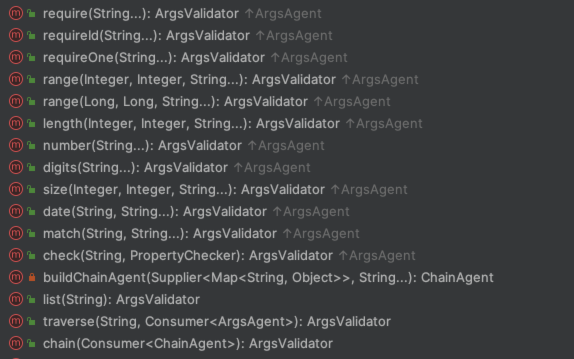

# 接口服务校验的设计及实现

接口服务的参数校验工作在开发人员眼中是一项“下水道工程”，因为这类开发工作，做的到位不会有任何KPI帮助，也不会
体现在交互体验的提升上，但是如果不做，那么在不确定的未来可能就为自己埋了一个天坑。

在实际的开发中接口服务类的检查主要涉及两类场景：

1. API入口参数的格式检查，这一步的目的在于为服务层提供合法合格的入参数据

2. 服务层调用过程中的参数逻辑检查，此类检查多是基于业务逻辑处理目的执行的检查控制

## API入口参数格式检查

关于入口参数格式检查，常见的有hibernate-validator等第三方开发包，在GP框架中提供了类似参数校验处理工具类。

* Api服务中可以通过ArgsValidator.newValidator()实现参数格式检查

``` 
@WebApi(path="endpoint-save")
public void handleEndpointSave(HttpServerExchange exchange) throws BaseException {
    ActionResult result = null;
    Map<String, Object> params = this.getRequestBody(exchange);
    // 参数检查
    ArgsValidator.newValidator(params)
        .requireId("endpoint_id")
        .validate(true);
    
    ServiceContext svcctx = this.getServiceContext(exchange);
    
    ......
    result = ActionResult.success(getMessage(exchange, "mesg.save.endpoint"));

    this.sendResult(exchange, result);
}
```
* Api服务中可以通过ParamInspector实现参数格式检查

```
@WebApi(path="endpoint-save")
public void handleEndpointSave(HttpServerExchange exchange) throws BaseException {
    ActionResult result = null;
    Map<String, Object> params = this.getRequestBody(exchange);
    // 参数检查
    ParamInspector inspector = ParamInspector.wrap(params);
    inspector.validate(valid->{
       alid.require("endpoint_id");
    );
    
    ServiceContext svcctx = this.getServiceContext(exchange);
    
    ......
    result = ActionResult.success(getMessage(exchange, "mesg.save.endpoint"));

    this.sendResult(exchange, result);
}
```

API格式检查支持如下检查项：



*API检查项*

## 服务层的参数校验检查


