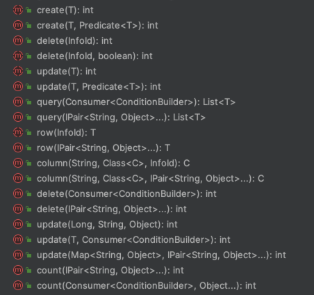
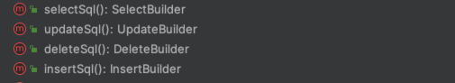
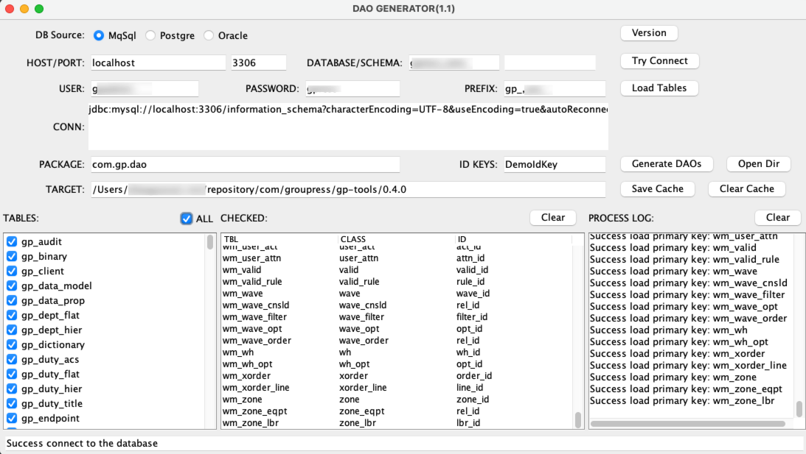

# DAO的设计及实现

引自网络：
>DAO 是一种设计模式，用于将应用程序的业务逻辑和数据访问逻辑分离。它提供了一种将数据访问代码从业务逻辑中分离出来的方法，从而提高了代码的可维护性和可测试性。
>在DAO模型中，数据访问逻辑被封装在称为数据访问对象（DAO）的类中。这些DAO类负责处理与数据存储相关的所有操作，如增加、删除、更新和查询。业务逻辑层则通过DAO接口或实现类来访问数据，而无需了解底层的数据存储细节。<br>
> 
>典型的DAO模型包括以下元素：
>DAO接口（Data Access Interface）： 定义了数据访问操作的接口，包括创建、读取、更新和删除（CRUD）等方法。业务逻辑层通过调用这些接口来访问数据。<br>
>DAO实现类（Data Access Object Implementation）： 实现了DAO接口的具体类，包含了与数据存储相关的具体实现代码，例如通过数据库连接执行SQL语句。<br>
>实体类（Entity）： 代表了数据存储中的实际实体或对象，通常与数据库表的结构相对应。

## 框架数据设计思路

DAO对象代表了对每张数据的读写改查操作

* 数据设计层面要求每张数据表提供唯一整数ID作为唯一主键，这有助于简化业务数据的复杂性。
* 数据表可以有两类plain和traceable，plain表不在表中定义modify_time和modifier_uid, traceable类表提供两个字段。
* DAO的行为方法不建议进行定制修改，因为该类和相应Info封装类可以通过工具化进行处理。
* 为了满足在DAO层的定制化方法，提供了ExtendDAO基类用于对定制化代码进行封装。
* DAO层不需要考虑任何事务相关的控制处理，相关内容交由在Service层进行统一处理。

## BaseDAO介绍
  
BaseDAO提供了应用对数据库进行操作的一系列方法，同时在DAO中也定义了相应的ResultSet和PoJoBean之间的映射处理Mapper，此点和mybatisxml中的
结果映射类似。在BaseDAO对象中除了定义表对应的字段信息和Bean信息，对此有人可能会质疑为了保留了每张表的DAO实现，其实做到这个程度，完全可以消除
BaseDAO类，原因其实很简单：为了保证性能。任何以动态处理隐藏重复逻辑的处理都是以性能为代价的。

### CRUD基本方法


GP框架的DAO中支持参数对作为参数进行DB操作

``` 
// 方法调用示例
demoDAO.query(cond -> {
    if(expr1){
        cond.and("a = '" + var1 + "'");
    }
});

// 方法调用示例
demoDAO.query(pair("a", "0"), pair("b", ">", "0"));


// 方法调用示例
Integer num = demoDAO.column("follow_num", Integer.class, 
    pair("a", "0"), pair("b", ">", "0")
);

// 单行查询
DemoInfo row = demoDAO.row(pair("a", "0"), pair("b", ">", "0"));

```

### DSL构建方法


``` 
// 通过SQL操作数据
UpdateBuilder update = demoDAO.updateSql();

update.set("a", "?")
    .where("id = ?")
    
update(update.build(), "a1", 12345L);

```
   

## ExtendDAO介绍
    
ExtendDAO同样不关注任何事务相关操作，ExtendDAO的出现是为了弥补BaseDAO在某些场景下的不足如：
* 对单表的某些类似聚合运算的处理
* 非服务层的通用多表关联查询的处理

### 对单表的运算操作封装

``` 
@BindComponent
public class DemoExt extends DAOSupport implements ExtendDAO {

    public DemoExt(){
        this.setDataSource("secondary");
    }

    // 演示方法
    public int testCount(){

        SelectBuilder select = SqlBuilder.select(BaseIdKey.AUDIT);
        select.column("COUNT(1)");

        int cnt = count(select.build(), Lists.newArrayList());
        
        return cnt;
    }
}
```

### 非服务层的通用多表关联查询的处理

``` 
@BindComponent
public class DemoExt extends DAOSupport implements ExtendDAO {

    static Logger LOGGER = LoggerFactory.getLogger(DemoExt.class);

    /**
     * Get user's group ids and it's ancestors, this query depends on
     * procedure function: func_group_ancestry
     *
     **/
    public Set<Long> getUserGroups(Long userId, Long workgroupId){
        SelectBuilder select = SqlBuilder.select();
        select.column("g.group_id", "func_group_ancestry(g.group_id) AS ancestry_ids");
        select.from(MasterIdKey.GROUP.schema() + " AS g", MasterIdKey.GROUP_USER.schema() + " AS gu");
        select.where("g.group_id = gu.group_id");
        select.and("gu.member_uid = ?");
        List<Object> params = Lists.newArrayList();
        params.add(userId);
        if(workgroupId != null && workgroupId > 0) {
            select.and("g.manage_id = ?");
            params.add(workgroupId);
        }
        if(LOGGER.isDebugEnabled()){
            LOGGER.debug("SQL: {} / PARAMS: {}", select, userId);
        }
        Set<Long> gids = Sets.newHashSet();
        Splitter splitter = Splitter.on(',');
        query(select.build(), rs -> {
            Long grpid = rs.getLong("group_id");
            gids.add(grpid);
            String _ancestry = rs.getString("ancestry_ids");
            if(!Strings.isNullOrEmpty(_ancestry)) {
                Iterable<String> ancestors = splitter.split(_ancestry);
                ancestors.forEach(a -> gids.add(Long.valueOf(a)));
            }
        }, params);

        return gids;
    }
}
```

## 服务代码生成工具介绍

为了快速通过数据库表生成DAO相关的java类，GP框架提供了自动化的生成工具，开发者可以通过工具进行DAO的生成处理，该工具目前
支持mysql和postgreSql两类数据库



*DAO生成工具*