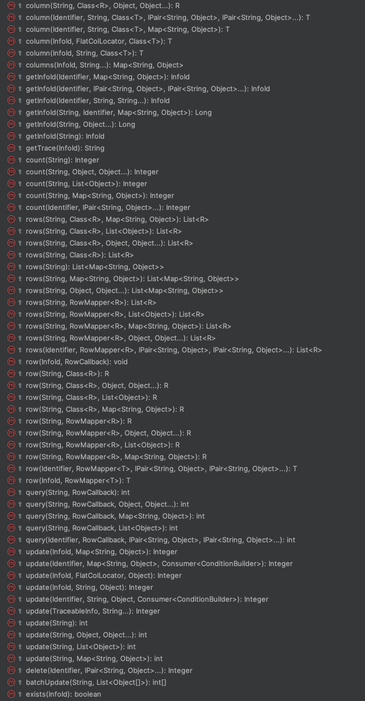

# Service数据服务的设计及实现

如果说DAO层主要用于封装功能性数据操作，那么服务层主要封装应用中业务逻辑实现。如同在事务内容中的介绍，服务层也是数据库事务操作的控制起点。

## 基础服务的设计实现

服务层的设计实现需考虑如下情况：
1. 服务层必须支持对数据库的直接操作，这和常见的设计模式不同，有些框架要求必须把全部SQL片段封装在DAO层的独立方法中以供服务层调用，GP框架
   不建议这种做法，因为对不具复用目的的此种封装完全多余，且对性能和可维护性没有任何好处。
2. 提供对DB事务的控制支持，通过TranService和@JdbiTran注解的配合实现事务控制。
3. 对于具备复杂的业务逻辑操作提供独立封装途径，比如订单发货动作，需要：修改库存，财务记录，修改订单状态等等组合操作。这类长逻辑实现最好的方式
   就是将完整的逻辑实现集中进行开发，在GP框架中通过ActionService实现。
4. 服务需要提供对象级的线程安全，而不仅仅限定于方法级线程安全。

所有的服务类都从ServiceSupport类进行扩展，提供如下方法：



基本数据操作有如下方法：

``` 
@BindComponent
public class AuthorizeService extends ServiceSupport implements JdbiService {

	Logger LOGGER = LoggerFactory.getLogger(AuthorizeService.class);

	@BindAutowired
	RoleDAO roledao;
	
	/**
	* JdbiService + @JdbiTran 配合启用事务处理
    */
	@JdbiTran
	public List<RoleInfo> getAllRoles() {
		SelectBuilder builder = SqlBuilder.select(MasterIdKey.ROLE.schema());

		if (LOGGER.isDebugEnabled()) {
			LOGGER.debug("SQL : {}" + builder.toString());
		}
		
		return rows(builder.toString(), RoleDAO.INFO_MAPPER);
		
	}

	@JdbiTran
	public List<RoleInfo> getUserRoles(InfoId uid, String username) {
		
		SelectBuilder builder = SqlBuilder.select();
		
		builder.column("r.*");
		
		builder.from(from ->{
			from.table(MasterIdKey.USER_ROLE.schema() + " ur");
			from.leftJoin(MasterIdKey.ROLE.schema() + " r", "ur.role_id = r.role_id");
			from.leftJoin(BaseIdKey.USER.schema() + " u", "ur.user_id = u.user_id");
		});
		
		List<Object> param = Lists.newArrayList();
		if(IdKeys.isValidId(uid)) {
			builder.or("u.user_id = ? ");
			param.add(uid.getId());
		}
		
		if(!Strings.isNullOrEmpty(username)) {
			builder.or("u.username = ? ");
			param.add(username);
		}
		
		if (LOGGER.isDebugEnabled()) {
			LOGGER.debug("SQL : {} / PARAM: {}", builder.toString(), param);
		}
				
	     // 数据库的直接操作
		return rows(builder.toString(), RoleDAO.INFO_MAPPER, param);
		
	}
}
```

### 线程安全场景的处理

在服务层支持类中，提供了对线程安全的相关处理，但在实际工作中不推荐此种做法，因为需要留意对线程安全变量的清除动作。

```
// 单实例对象的跨方法，线程安全的变量共享处理
@BindComponent
public class DemoService extends ServiceSupport implements JdbiService {

   static ExecAttrKey<String> SKEY = ExecContext.itemKey("SDEMO", String.class);
   
    @JdbiTran
	public void demoMeth0() {
	     String var1 = "global access";
	     try{
	        setExecAttr(SKEY, var1);
	        
	        demoMeth1();
	        
	        demoMeth2();
	        
	     }finally{
	        // 清除变量
	        clearExecContext();
	     }
	}
	
	void demoMeth1() {
	     // 全局变量的跨方法获取
	     String var1 = getExecAttr(SKEY);
	     // 相关变量操作
	     ....
	}
	
	void demoMeth2() {
	     // 全局变量的跨方法获取
	     String var1 = getExecAttr(SKEY);
	     // 相关变量操作
	     ....
	}
	
}

```

## ActionSupport设计服务实现

在实际的产品级系统开发中，业务功能往往是跨表的长逻辑业务，如生产排程，财务结算等等。为解决长逻辑的封装和随之而来的全局线程安全变量的需要
设计了ActionSupport基础类，该类是在ServiceSupport基础上做的扩展继承。

为了实现支持线程安全的变量管理，在ActionSupport中增加了ContextVars功能，即通过ThreadLocal的ContextVars变量对变量进行线程级管理。

``` 
// 动作类示例
@BindComponent
public class DemoAction extends ActionSupport<OptionResult, DemoParam> implements BaseService {
    
    @BindAutowired
    DemoDAO demoDAO;
   
    @BindAutowired
    DemoExt demoExt;
    
    @Override
    protected OptionResult _perform(DemoParam param) throws ServiceException {
        // 取得环境变量
        ContextVars vars = getVars();
        
        demoMeth1();
        
        System.out.println(vars.var2);
        // print： reset var2
        
        return OptionResult.success("");
    }
    
    void demoMeth1(){
    
        // 方法中可以对变量进行读写
        ContextVars vars = getVars();
        DemoParam param = getParameter();
        vars.var2 = "reset var2";
    }
    
    @Override
    protected boolean validate() throws ServiceException {

         // 在验证函数中执行环境变量初始化
        DemoParam param = getParameter();
        ContextVars vars = resetVars(ContextVars::new);

        vars.procKey = param.getProcKey();

        return super.validate();
    }
    
    // 环境变量类根据业务需要自行进行定义
    static class ContextVars{
        boolean var1 = false;
        String var2 = "var2";
    }
}
```

上述代码介绍了ActionSupport下的动作服务类的实现过程，以及如何定义全局的线程安全变量的使用。

### 代码片段的注入支持

在某些固定业务场景下，有时需要提供必要的代码注入。GP框架不推荐aspect-j风格的注入实现，因为只有受控的注入才可以保证应用的最终稳定性。

``` 
// 预先注册注入逻辑：DEMO:POINT1 / DEMO:POINT2
ActionManager.register("DEMO:POINT1", (action) -> {
    System.out.println("enter inject point")
});

ActionManager.register("DEMO:POINT2", (action) -> {
    System.out.println("enter inject point")
});

@BindComponent
public class DemoAction extends ActionSupport<OptionResult, DemoParam> implements BaseService {

    @Override
    protected OptionResult _perform(DemoParam param) throws ServiceException {
        // 取得环境变量
        ContextVars vars = getVars();
        
        demoMeth1();
        
        // 执行预先设定的注入逻辑点
        inject("DEMO:POINT2");
        
        System.out.println(vars.var2);
        // print： reset var2
        
        return OptionResult.success("");
    }
    
    void demoMeth1(){
    
        // 方法中可以对变量进行读写
        ContextVars vars = getVars();
        DemoParam param = getParameter();
        
        // 执行预先设定的注入逻辑点
        inject("DEMO:POINT1");
    }
}

// 执行Action
// 初始化参数
DemoParam param = new DemoParam();
param.addArg(OptionArg.newArg("avar1", "aval1"));

// 获得action单实例对象
DemoAction action = ActionManager.getActionService(DemoAction.class);
// 执行动作对象
OptionResult result = action.perform(param);
```

## LinkerService设计服务实现

熟悉ERP开发的人一定对数据库的Trigger功能爱恨交加，一方面可以对特定事件进行捕捉处理，便于集成通用处理逻辑，但是因为执行环境的特殊性，使它
又有难以控制的一面。如果深入思考以下就会明白，trigger重要的意义在于对特定业务事件的捕捉，进行采用相应的应对逻辑，这种设计模式，对于事件关
联的业务代码进行集中维护很有帮助，比如跟踪订单状态的变化自动发出业务协同消息等。

GP框架为了实现类似数据库的trgger功能，设计了LinkerService，通过LinkerService，开发者可以实现类似trgger的功能，它也是基于ServiceSupport基础
上进行的扩展继承。

``` 
// LinderService声明示例
@BindComponent
public class DemoLinker extends LinkerSupport<OptionResult, DemoLink> implements BaseService, IBeanBinder {

   ....
    public DemoLinker(){
        register();
    }

    @Override
    protected OptionResult before() throws ServiceException {

        TrsfLink param = getParameter();
        ContextVars vars = resetVars(ContextVars::new);

        if(IdKeys.isValidId(param.getLineId())){
            vars.line = lineDAO.row(pair("line_id", param.getLineId()));
        }

        return null;
    }

    @Override
    protected OptionResult after(boolean before) throws ServiceException {

        DemoLink param = getParameter();
        ContextVars vars = getVars();

        if(IdKeys.isValidId(param.getDemoId())) {
            DemoInfo demo = demoDAO.row(pair("demo_id", param.getDemoId()));
            if (vars.line == null && before && demo != null){

                insertTransfer(demo);
            }else if(vars.line != null && before && demo != null){

                updateTransfer(param.getDemoId());
            }else if(vars.line != null && before && demo == null){

                deleteTransfer(vars.line);
            }
        }

        return null;
    }
   ....
}

// Linker Service的使用

UpdateBuilder udpate = demoDAO.updateSql();
update.set("c1", "v1");
update.where("demo_id = ?");

DemoLinker linker = ActionManager.getLinkerService(DemoLinker.class);
DemoLink link = new DemoLink();

// 执行更新及linker的触发绑定
linker.perform(link, linkCtx ->{
   update(update.build(), 1234L);
});

```

## 总结

在服务层的设计中，GP框架提供基本服务对象，ActionService对象和LinkerService对象。在实际工作中建议按如下的方式使用上述的的设计模式：
1. ActionService和LinkerService仅用于对相对固化和复用代码的封装，不建议在二者上面进行事务控制。
2. 事务控制通过基本服务对象配合TranService+@JdbiTran实现。
3. 如果需要实现跨服务方法的线程安全，那么参考ActionService的设计模式。

